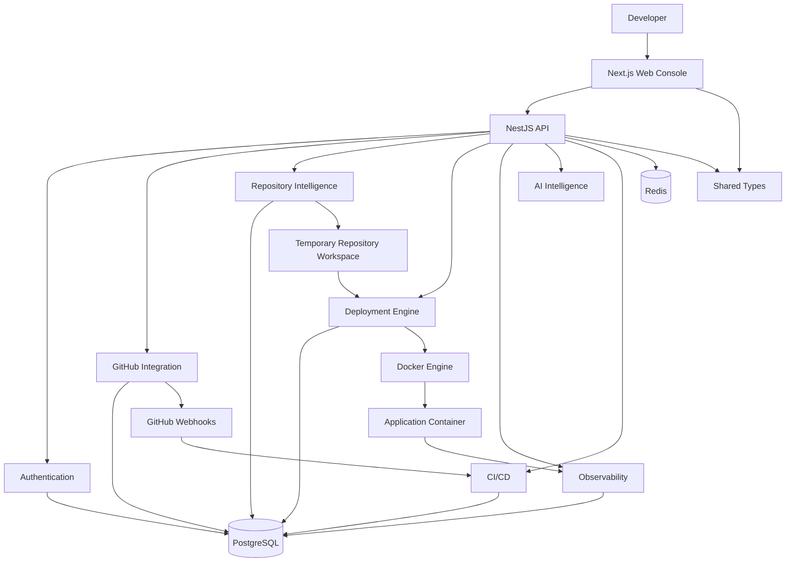
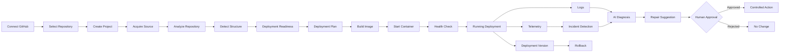
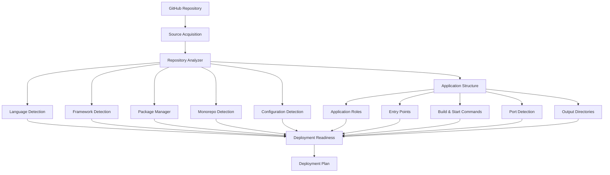
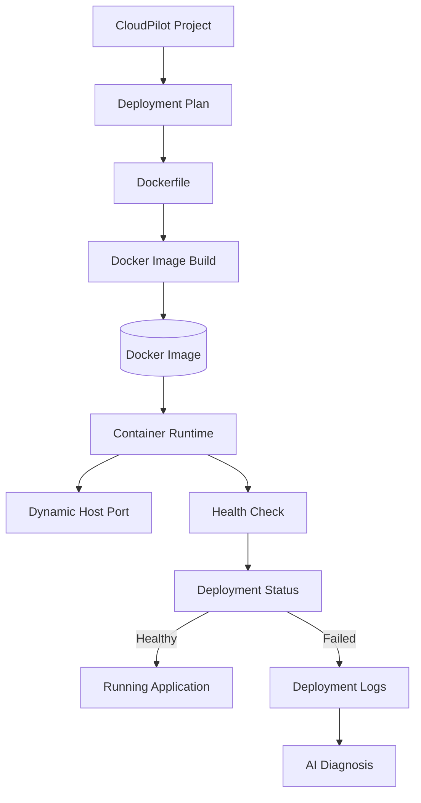
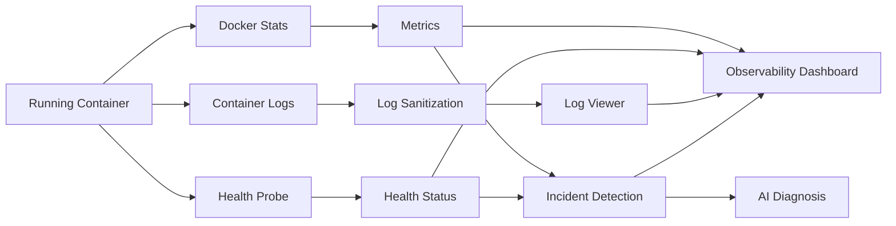
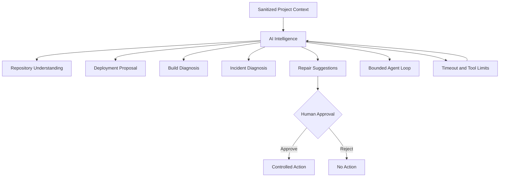

# CloudPilot

> AI-Powered Cloud Deployment, Repository Intelligence & Observability Platform

CloudPilot is a full-stack developer platform that turns a GitHub repository into an analyzed, containerized, monitored, and manageable deployment.

It combines repository intelligence, automated Docker deployment, observability, AI-assisted diagnostics, multi-environment configuration, CI/CD webhooks, versioning, and rollback support in a single developer console.

## What CloudPilot Does

CloudPilot follows a repository-to-deployment workflow:

```text
GitHub Repository
       |
       v
Repository Acquisition
       |
       v
Repository Analysis
       |
       +--> Language & Technology Detection
       +--> Framework & Package Manager Detection
       +--> Monorepo Detection
       +--> Application Structure Detection
       |
       v
Deployment Readiness
       |
       v
Deployment Plan
       |
       v
Docker Image Build
       |
       v
Container Deployment
       |
       v
Health Validation
       |
       v
Observability
       |
       +--> Metrics
       +--> Logs
       +--> Health
       +--> Events
       |
       v
AI Diagnostics
       |
       v
CI/CD, Versioning & Rollback
```

The main principle is:

> Analyze first, deploy safely, observe continuously, and keep AI actions bounded by human approval.

## Product Screenshots

### Dashboard


### Repository Analysis


### Deployment


### Observability


### AI Intelligence


Screenshots are stored in `docs/screenshots/`.

# System Architecture

CloudPilot uses a monorepo architecture with separate web and API applications and a shared package for types and contracts.



## Architecture Components

| Component               | Responsibility                                                          |
| ----------------------- | ----------------------------------------------------------------------- |
| Web Console             | Dashboard, projects, deployment, observability, AI and CI/CD interfaces |
| API                     | Authentication, authorization, APIs and platform orchestration          |
| Repository Intelligence | Technology, framework, structure and deployment analysis                |
| Deployment Engine       | Dockerfile handling, image builds, containers and health checks         |
| Observability           | Metrics, logs, health status and operational events                     |
| AI Intelligence         | Repository understanding, diagnostics and repair suggestions            |
| CI/CD                   | Environments, variables, webhooks, versions and rollback                |
| PostgreSQL              | Persistent application and operational data                             |
| Redis                   | Runtime and fast-access state                                           |
| Docker                  | Application build and execution environment                             |

# End-to-End Platform Flow



# Repository Intelligence

CloudPilot analyzes repositories before deployment without executing arbitrary repository code.



### Analysis Capabilities

* Language detection using deterministic file and extension analysis
* Framework detection
* Package manager detection
* Monorepo identification
* Application role detection
* Entry-point discovery
* Build and start command detection
* Application port detection
* Output-directory detection
* Environment-variable analysis
* Docker and Docker Compose detection
* Deployment readiness scoring
* Blocker and warning identification
* Multi-application readiness analysis

# Deployment Architecture

Docker is used as the execution layer for deployed applications.



## Deployment Lifecycle

1. Validate project ownership and environment.
2. Acquire repository source in a temporary workspace.
3. Analyze the repository.
4. Evaluate deployment readiness.
5. Generate a deployment plan.
6. Generate or validate the Dockerfile.
7. Build the Docker image.
8. Allocate a host port.
9. Start the container with resource and security restrictions.
10. Run health validation.
11. Persist deployment state and logs.
12. Start telemetry collection.

Application and host ports are intentionally different.

For example, an application may listen on port `5000` inside its container while CloudPilot exposes it through a dynamically allocated host port such as `11002`.

# Observability

CloudPilot continuously monitors running deployments.



### Monitored Signals

* CPU utilization
* Memory usage and limits
* Network input/output
* Block I/O
* Process count
* Container status
* Health-check status
* Health latency
* Uptime
* Operational events
* Deployment logs
* Container logs

Logs are sanitized before being returned to the UI, including ANSI stripping and secret/token redaction.

# Controlled AI Intelligence

CloudPilot's AI layer is designed as a bounded engineering assistant rather than an unrestricted execution agent.



### AI Capabilities

* Repository understanding
* Architecture analysis
* Deployment proposals
* Build failure diagnosis
* Incident diagnosis
* Repair suggestions
* Bounded agent workflow

### AI Safety Boundaries

* Repository context is sanitized before AI processing.
* AI cannot directly execute arbitrary shell commands.
* AI cannot directly execute database commands.
* AI operations use strict timeouts.
* Agent iterations and tool calls are bounded.
* AI routes use dedicated rate limits.
* Repair suggestions require explicit human approval.

# Security

CloudPilot applies defense-in-depth across authentication, secrets, APIs, AI operations, containers, and CI/CD.

## Authentication and Secrets

* GitHub OAuth authentication
* CSRF-protected OAuth state
* Server-side HTTP-only sessions
* AES-256-GCM encryption for GitHub tokens and environment secrets
* Secrets masked in the frontend
* Sensitive credentials are not stored in client-side storage

## API Security

* Helmet security headers
* Global request rate limiting
* Stricter limits for AI routes
* Global exception handling
* No stack traces in production responses
* Startup configuration validation
* Project ownership checks

## Container Security

* Docker-based isolation
* Resource limits
* `no-new-privileges`
* Localhost-bound host ports
* Temporary repository workspaces
* Cleanup of temporary and orphaned resources

## CI/CD Security

* HMAC verification for GitHub webhooks
* Idempotent webhook processing
* Encrypted environment variables
* Sequential deployment versioning
* Controlled rollback to previous healthy versions

# Project Structure

CloudPilot is organized as an npm workspace monorepo.

```text
CloudPilot/
│
├── apps/
│   ├── web/                         # Next.js frontend
│   │   ├── app/
│   │   │   ├── dashboard/
│   │   │   └── projects/[id]/
│   │   ├── components/
│   │   │   ├── ui/
│   │   │   └── project/
│   │   └── ...
│   │
│   └── api/                         # NestJS backend
│       ├── src/
│       │   ├── auth/
│       │   ├── github/
│       │   ├── projects/
│       │   ├── repository/
│       │   ├── deployment/
│       │   ├── observability/
│       │   ├── ai/
│       │   ├── cicd/
│       │   ├── health/
│       │   ├── prisma/
│       │   └── main.ts
│       ├── prisma/
│       │   └── schema.prisma
│       └── ...
│
├── packages/
│   └── shared/                      # Shared TypeScript contracts
│       ├── src/
│       │   ├── dto/
│       │   └── types/
│       └── package.json
│
├── infrastructure/
│   └── docker/                      # Docker configuration
│
├── docs/
│   ├── ARCHITECTURE.md
│   ├── SECURITY.md
│   └── screenshots/
│
├── .env.example
├── docker-compose.yml
├── package.json
├── tsconfig.base.json
└── README.md
```

# Technology Stack

| Area               | Technologies                                         |
| ------------------ | ---------------------------------------------------- |
| Frontend           | Next.js 15, React, TypeScript, Tailwind CSS          |
| Backend            | NestJS 11, TypeScript                                |
| ORM                | Prisma                                               |
| Database           | PostgreSQL 16                                        |
| Cache              | Redis 7                                              |
| Containerization   | Docker, Docker Compose                               |
| Authentication     | GitHub OAuth, HTTP-only sessions                     |
| Security           | Helmet, CSRF protection, AES-256-GCM, rate limiting  |
| AI                 | Controlled AI diagnostics and bounded agent workflow |
| CI/CD              | GitHub Webhooks, environments, versioning, rollback  |
| Testing            | Unit/integration tests, type-checking, linting       |
| Package Management | npm workspaces                                       |

# Project Roadmap

CloudPilot was developed incrementally across eight major phases.

| Phase | Focus                                         | Status   |
| ----- | --------------------------------------------- | -------- |
| 1     | Project Foundation                            | Complete |
| 2     | Authentication, GitHub Integration & Projects | Complete |
| 3     | Repository Intelligence                       | Complete |
| 4     | Containerization & Deployment Engine          | Complete |
| 5     | Observability & Real-Time Monitoring          | Complete |
| 6     | Controlled AI Intelligence                    | Complete |
| 7     | Advanced Engineering & CI/CD                  | Complete |
| 8     | Production Hardening & Polish                 | Complete |

# API Overview

CloudPilot exposes REST APIs around its main platform capabilities.

### Authentication

```text
GET    /auth/github
GET    /auth/github/callback
GET    /auth/me
POST   /auth/logout
```

### GitHub Integration

```text
GET    /github/repositories
GET    /github/repositories/:owner/:repo
GET    /github/repositories/:owner/:repo/branches
```

### Projects and Repository Intelligence

```text
POST   /projects
GET    /projects
GET    /projects/:id

POST   /projects/:id/analyze
GET    /projects/:id/analysis

POST   /projects/:id/analyze-structure
GET    /projects/:id/structure

POST   /projects/:id/analyze-readiness
GET    /projects/:id/readiness

POST   /projects/:id/acquire-source
```

### Deployment

```text
POST   /projects/:id/deployment-plan
POST   /projects/:id/deploy
GET    /projects/:id/deployments
GET    /projects/:id/deployments/:depId
GET    /projects/:id/deployments/:depId/logs
POST   /projects/:id/deployments/:depId/cancel
```

### Observability

```text
GET    /projects/:id/deployments/:depId/telemetry
GET    /projects/:id/deployments/:depId/metrics
POST   /projects/:id/deployments/:depId/metrics/collect
GET    /projects/:id/deployments/:depId/logs/tail
GET    /projects/:id/deployments/:depId/events
```

### AI Intelligence

```text
POST   /projects/:projectId/ai/understand
POST   /projects/:projectId/ai/deployment-proposal

POST   /projects/:projectId/deployments/:depId/ai/diagnose-build
POST   /projects/:projectId/deployments/:depId/ai/diagnose-incident

GET    /projects/:projectId/deployments/:depId/ai/repair-suggestions

POST   /projects/:projectId/ai/repair-suggestions/:suggestionId/approve
POST   /projects/:projectId/ai/repair-suggestions/:suggestionId/reject

POST   /projects/:projectId/ai/agent
```

### CI/CD and Environments

```text
GET    /projects/:projectId/environments
POST   /projects/:projectId/environments
PATCH  /projects/:projectId/environments/:envId
DELETE /projects/:projectId/environments/:envId

GET    /projects/:projectId/environments/:envId/variables
POST   /projects/:projectId/environments/:envId/variables
DELETE /projects/:projectId/environments/:envId/variables/:varId

POST   /projects/:projectId/deployments/:depId/rollback

GET    /projects/:projectId/cicd/settings
PATCH  /projects/:projectId/cicd/settings
GET    /projects/:projectId/cicd/webhook-events

POST   /webhooks/github
```

# Getting Started

## Prerequisites

* Node.js 20+ or 22+
* npm 10+
* Docker Desktop
* Docker Compose
* Git
* GitHub account
* GitHub OAuth application

## 1. Clone the Repository

```bash
git clone https://github.com/L-Praveen36/CloudPilot.git
cd CloudPilot
```

## 2. Install Dependencies

```bash
npm install
```

## 3. Configure Environment Variables

Create the local environment file:

```bash
cp .env.example .env
```

Generate a 32-byte encryption key:

```bash
node -e "console.log(require('crypto').randomBytes(32).toString('hex'))"
```

Set the generated value as:

```text
GITHUB_TOKEN_ENCRYPTION_KEY=<64-character-hex-key>
```

Configure the remaining GitHub, PostgreSQL, Redis, and AI variables required by the environment.

Never commit `.env` or real credentials to Git.

## 4. Start PostgreSQL and Redis

```bash
docker compose up -d
```

## 5. Generate Prisma Client and Synchronize Database

```bash
npm run db:generate
npm run db:push
```

## 6. Start the Backend

```bash
npm run dev:api
```

Backend:

```text
http://localhost:3001
```

Health check:

```text
http://localhost:3001/health
```

## 7. Start the Frontend

Open another terminal:

```bash
npm run dev:web
```

Frontend:

```text
http://localhost:3000
```

# Quality and Verification

Run the complete project checks:

```bash
npm test
npm run type-check
npm run lint
npm run build
```

The project includes automated testing and verification for authentication, GitHub integration, repository intelligence, deployment, observability, AI functionality, CI/CD, and production-hardening behavior.

# Documentation

Additional technical documentation is available in:

* `docs/ARCHITECTURE.md` — detailed architecture, workflows and state transitions
* `docs/SECURITY.md` — security model, secret handling and execution boundaries

# Key Engineering Highlights

## Repository Intelligence

Static and deterministic repository analysis is performed before deployment to understand technologies, frameworks, structure, commands, ports, and deployment readiness.

## Automated Deployment

CloudPilot handles Dockerfile generation or validation, image building, dynamic host-port allocation, container startup, and health validation.

## Real-Time Observability

Running deployments provide container metrics, searchable logs, health information, uptime, and operational events.

## Guarded AI

AI provides repository understanding, deployment diagnostics, incident analysis, and repair suggestions while operating within strict tool, timeout, and approval boundaries.

## Multi-Environment CI/CD

CloudPilot supports environment-specific configuration, encrypted variables, GitHub webhooks, deployment versioning, and rollback.

## Security by Design

The platform uses encrypted credentials, HTTP-only sessions, rate limiting, secure container execution, webhook verification, and sanitized logs and errors.

# Author

**Lunavath Praveen Kumar**

B.Tech — Mathematics and Computing
Indian Institute of Technology Indore

* GitHub: [L-Praveen36](https://github.com/L-Praveen36)
* Portfolio: [portfolio-praveen-one](https://portfolio-praveen-one.vercel.app/)

# Why CloudPilot?

CloudPilot brings together several normally separate developer workflows:

```text
Repository Analysis
        ↓
Deployment Planning
        ↓
Containerization
        ↓
Deployment
        ↓
Monitoring
        ↓
AI Diagnosis
        ↓
CI/CD
        ↓
Rollback
```

Instead of treating deployment as a single command, CloudPilot provides a complete engineering workflow around the application lifecycle.
