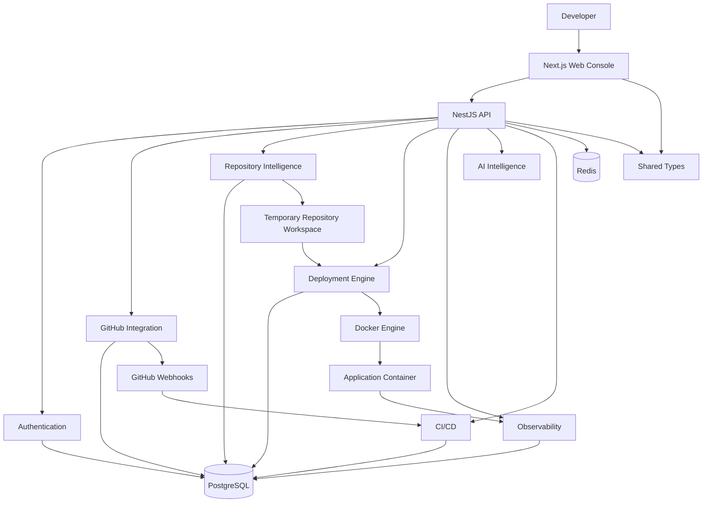

# CloudPilot

### AI-Powered Cloud Deployment, Repository Intelligence & Observability Platform

CloudPilot is a full-stack developer platform that transforms a GitHub repository into an analyzed, containerized, monitored, and manageable deployment.

It brings repository intelligence, automated Docker deployment, observability, AI-assisted diagnostics, CI/CD, environment management, versioning, and rollback into a single developer console.

---

## Overview

CloudPilot is built around a simple workflow:

```text
Repository
    ↓
Repository Analysis
    ↓
Deployment Planning
    ↓
Docker Build
    ↓
Container Deployment
    ↓
Health Validation
    ↓
Observability
    ↓
AI Diagnostics
    ↓
CI/CD & Rollback
```

The platform follows the principle:

> **Analyze first, deploy safely, observe continuously, and keep AI actions bounded by human approval.**

---

## Features

### Repository Intelligence

CloudPilot analyzes a repository before deployment without executing arbitrary repository code.

* Language detection
* Framework detection
* Package manager detection
* Monorepo detection
* Application role detection
* Entry-point discovery
* Build and start command detection
* Application port detection
* Output-directory detection
* Environment-variable analysis
* Docker and Docker Compose detection
* Deployment readiness scoring
* Blocker and warning identification

### Automated Deployment

CloudPilot manages the complete deployment lifecycle:

* Repository source acquisition
* Deployment readiness analysis
* Deployment plan generation
* Dockerfile generation or validation
* Docker image building
* Dynamic host-port allocation
* Container startup
* Health validation
* Deployment state and log tracking

Application ports and host ports are intentionally separated. For example, an application can listen on `5000` inside its container while CloudPilot exposes it through a dynamically allocated host port.

### Real-Time Observability

Running deployments can be monitored through:

* CPU utilization
* Memory usage and limits
* Network I/O
* Block I/O
* Process count
* Container status
* Health-check status
* Health latency
* Uptime
* Operational events
* Container and deployment logs

Logs are sanitized before being returned to the frontend, including ANSI stripping and secret/token redaction.

### Controlled AI Intelligence

CloudPilot uses AI as a bounded engineering assistant rather than an unrestricted execution agent.

AI capabilities include:

* Repository understanding
* Architecture analysis
* Deployment proposals
* Build diagnosis
* Incident diagnosis
* Repair suggestions
* Bounded agent workflows

AI operations are protected by:

* Sanitized repository context
* Tool restrictions
* Execution timeouts
* Iteration limits
* Dedicated AI rate limits
* Explicit human approval for repair actions

### CI/CD and Rollback

CloudPilot supports:

* Multiple environments
* Environment-specific variables
* Encrypted environment secrets
* GitHub webhooks
* Deployment versioning
* Sequential deployment tracking
* Rollback to previous healthy versions

---

# Architecture

CloudPilot uses a monorepo architecture with a Next.js frontend, NestJS backend, shared TypeScript contracts, PostgreSQL, Redis, and Docker.



### Architecture Components

| Component                   | Responsibility                                                          |
| --------------------------- | ----------------------------------------------------------------------- |
| **Web Console**             | Dashboard, projects, deployment, observability, AI and CI/CD interfaces |
| **API**                     | Authentication, authorization, APIs and platform orchestration          |
| **Repository Intelligence** | Repository structure and deployment analysis                            |
| **Deployment Engine**       | Docker builds, containers, ports and health checks                      |
| **Observability**           | Metrics, logs, health and operational events                            |
| **AI Layer**                | Repository understanding, diagnostics and repair suggestions            |
| **CI/CD**                   | Environments, webhooks, versions and rollback                           |
| **PostgreSQL**              | Persistent application and operational state                            |
| **Redis**                   | Runtime and fast-access state                                           |
| **Docker**                  | Application build and execution                                         |

---

# Project Structure

CloudPilot follows an npm workspace monorepo structure.

```text
CloudPilot/
│
├── apps/
│   │
│   ├── web/                         # Next.js frontend
│   │   ├── app/
│   │   │   ├── dashboard/
│   │   │   └── projects/[id]/
│   │   ├── components/
│   │   │   ├── ui/
│   │   │   └── project/
│   │   └── ...
│   │
│   └── api/                         # NestJS backend
│       ├── src/
│       │   ├── auth/
│       │   ├── github/
│       │   ├── projects/
│       │   ├── repository/
│       │   ├── deployment/
│       │   ├── observability/
│       │   ├── ai/
│       │   ├── cicd/
│       │   ├── health/
│       │   ├── prisma/
│       │   └── main.ts
│       ├── prisma/
│       │   └── schema.prisma
│       └── ...
│
├── packages/
│   └── shared/                      # Shared TypeScript contracts
│       ├── src/
│       │   ├── dto/
│       │   └── types/
│       └── package.json
│
├── infrastructure/
│   └── docker/                      # Docker configuration
│
├── docs/
│   ├── ARCHITECTURE.md
│   ├── SECURITY.md
│   └── screenshots/
│
├── .env.example
├── docker-compose.yml
├── package.json
├── tsconfig.base.json
└── README.md
```

---

# Technology Stack

| Category               | Technology                                           |
| ---------------------- | ---------------------------------------------------- |
| **Frontend**           | Next.js 15, React, TypeScript                        |
| **Styling**            | Tailwind CSS                                         |
| **Backend**            | NestJS 11, TypeScript                                |
| **ORM**                | Prisma                                               |
| **Database**           | PostgreSQL 16                                        |
| **Cache**              | Redis 7                                              |
| **Containerization**   | Docker, Docker Compose                               |
| **Authentication**     | GitHub OAuth, HTTP-only sessions                     |
| **Security**           | Helmet, CSRF protection, AES-256-GCM, rate limiting  |
| **AI**                 | Controlled AI diagnostics and bounded agent workflow |
| **CI/CD**              | GitHub Webhooks, environments, versioning, rollback  |
| **Testing**            | Unit/integration tests, type-checking, linting       |
| **Package Management** | npm workspaces                                       |

---

# Security

CloudPilot applies security controls across authentication, APIs, secrets, containers, AI operations, and CI/CD.

### Authentication & Secrets

* GitHub OAuth authentication
* CSRF-protected OAuth state
* HTTP-only server-side sessions
* AES-256-GCM encrypted credentials
* Encrypted environment variables
* Frontend secret masking

### API Security

* Helmet security headers
* Global request rate limiting
* Dedicated limits for AI routes
* Global exception handling
* Production-safe error responses
* Startup configuration validation
* Project ownership checks

### Container Security

* Docker-based isolation
* Resource limits
* `no-new-privileges`
* Localhost-bound host ports
* Temporary repository workspaces
* Cleanup of temporary and orphaned resources

### CI/CD Security

* HMAC verification for GitHub webhooks
* Idempotent webhook processing
* Encrypted environment variables
* Deployment version tracking
* Controlled rollback

---

# API Overview

CloudPilot exposes REST APIs across its major platform modules.

| Module             | Operations                                             |
| ------------------ | ------------------------------------------------------ |
| **Authentication** | GitHub OAuth, sessions, logout                         |
| **GitHub**         | Repository and branch access                           |
| **Projects**       | Project creation and management                        |
| **Analysis**       | Repository, structure and readiness analysis           |
| **Deployment**     | Plans, deployment, status, logs and cancellation       |
| **Observability**  | Metrics, telemetry, logs and events                    |
| **AI**             | Understanding, proposals, diagnosis and agent workflow |
| **Environments**   | Environment and variable management                    |
| **CI/CD**          | Settings, webhook events and rollback                  |

### Representative Endpoints

```text
GET    /auth/github
GET    /auth/me
POST   /auth/logout

GET    /github/repositories

POST   /projects
GET    /projects/:id
POST   /projects/:id/analyze
GET    /projects/:id/readiness

POST   /projects/:id/deploy
GET    /projects/:id/deployments

GET    /projects/:id/deployments/:depId/telemetry
GET    /projects/:id/deployments/:depId/logs

POST   /projects/:projectId/ai/understand
POST   /projects/:projectId/ai/deployment-proposal
POST   /projects/:projectId/ai/agent

GET    /projects/:projectId/environments
POST   /projects/:projectId/deployments/:depId/rollback

POST   /webhooks/github
```

---

# Project Roadmap

| Phase | Focus                                         | Status   |
| ----- | --------------------------------------------- | -------- |
| **1** | Project Foundation                            | Complete |
| **2** | Authentication, GitHub Integration & Projects | Complete |
| **3** | Repository Intelligence                       | Complete |
| **4** | Containerization & Deployment Engine          | Complete |
| **5** | Observability & Real-Time Monitoring          | Complete |
| **6** | Controlled AI Intelligence                    | Complete |
| **7** | Advanced Engineering & CI/CD                  | Complete |
| **8** | Production Hardening & Polish                 | Complete |

---

# Getting Started

## Prerequisites

* Node.js 20+ or 22+
* npm 10+
* Docker Desktop
* Docker Compose
* Git
* GitHub account
* GitHub OAuth application

## 1. Clone

```bash
git clone https://github.com/L-Praveen36/CloudPilot.git
cd CloudPilot
```

## 2. Install Dependencies

```bash
npm install
```

## 3. Configure Environment

Create the local environment file:

```bash
cp .env.example .env
```

Generate a 32-byte encryption key:

```bash
node -e "console.log(require('crypto').randomBytes(32).toString('hex'))"
```

Set the generated value as:

```text
GITHUB_TOKEN_ENCRYPTION_KEY=<64-character-hex-key>
```

Configure the remaining GitHub, PostgreSQL, Redis, and AI variables required by the environment.

> Never commit `.env` or real credentials to Git.

## 4. Start PostgreSQL and Redis

```bash
docker compose up -d
```

## 5. Setup Database

```bash
npm run db:generate
npm run db:push
```

## 6. Start Backend

```bash
npm run dev:api
```

API:

```text
http://localhost:3001
```

Health check:

```text
http://localhost:3001/health
```

## 7. Start Frontend

Open another terminal:

```bash
npm run dev:web
```

Frontend:

```text
http://localhost:3000
```

---

# Testing

Run the complete verification suite:

```bash
npm test
npm run type-check
npm run lint
npm run build
```

The project includes automated testing across authentication, GitHub integration, repository intelligence, deployment, observability, AI, CI/CD, and production-hardening functionality.

---

# Documentation

Additional technical documentation:

* [`docs/ARCHITECTURE.md`](docs/ARCHITECTURE.md) — detailed architecture and workflows
* [`docs/SECURITY.md`](docs/SECURITY.md) — security model and execution boundaries

---

# Engineering Highlights

### Repository Intelligence

Deterministic static analysis evaluates repositories before deployment and identifies technologies, frameworks, structure, commands, ports, and deployment readiness.

### Automated Deployment

Dockerfile generation or validation, image building, dynamic host-port allocation, container startup, and health validation are handled by the deployment engine.

### Observability

Running deployments provide container metrics, searchable logs, health information, uptime, and operational events.

### Guarded AI

AI assists with repository understanding, deployment diagnostics, incident analysis, and repair suggestions while remaining bounded by technical limits and human approval.

### Multi-Environment CI/CD

Environment-specific configuration, encrypted variables, GitHub webhooks, deployment versions, and rollback are integrated into the platform.

### Security by Design

Encrypted credentials, HTTP-only sessions, rate limiting, secure container execution, webhook verification, and log sanitization are built into the platform.

---

# Author

**Lunavath Praveen Kumar**

B.Tech — Mathematics and Computing
Indian Institute of Technology Indore

**GitHub:** [L-Praveen36](https://github.com/L-Praveen36)
**Portfolio:** [portfolio-praveen-one](https://portfolio-praveen-one.vercel.app/)

---

## CloudPilot

> **Repository Intelligence → Deployment → Observability → AI Diagnostics → CI/CD → Rollback**

CloudPilot turns application deployment from a collection of separate engineering tasks into a unified developer workflow.
