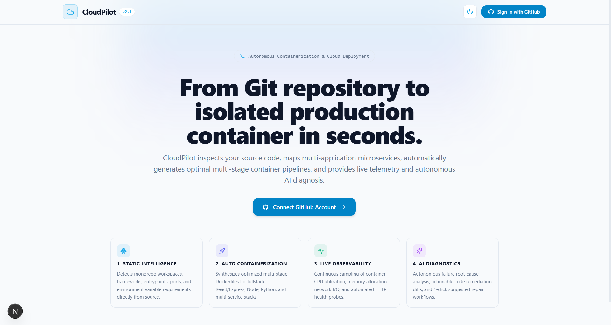
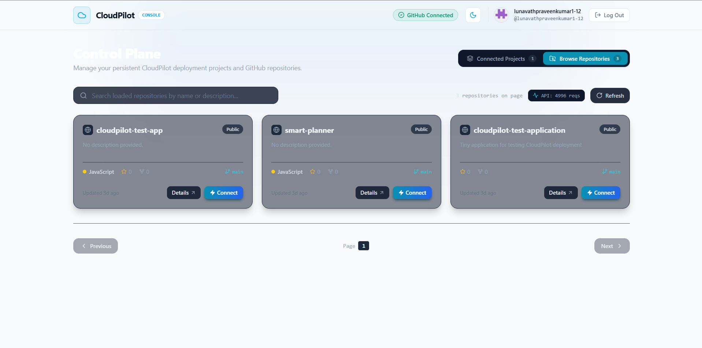
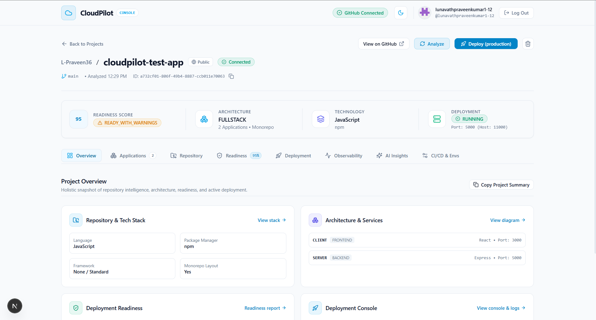
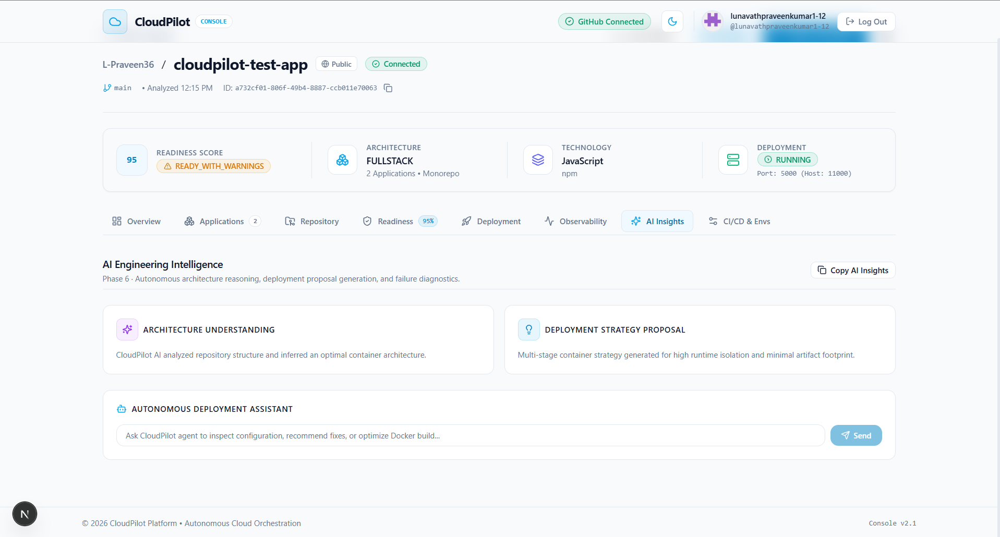
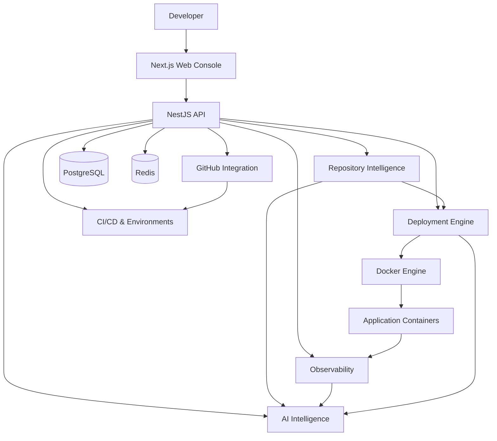

# CloudPilot

> **AI-Powered Cloud Deployment, Repository Intelligence & Observability Platform**

CloudPilot is a full-stack developer platform that analyzes GitHub repositories, evaluates deployment readiness, automates Docker-based deployments, monitors running applications, and provides AI-assisted diagnostics.

### Core Workflow

**GitHub Repository → Repository Analysis → Readiness Check → Deployment → Monitoring → AI Diagnostics → CI/CD → Rollback**

---

##  Features

-  **GitHub Integration** — Connect GitHub and import repositories.
-  **Repository Intelligence** — Detect languages, frameworks, package managers, monorepos and application structure.
-  **Deployment Readiness** — Identify blockers, warnings, deployment strategy and readiness score.
-  **Automated Deployment** — Generate Dockerfiles, build images and run containers.
-  **Health Monitoring** — Validate deployed applications using health checks.
-  **Observability** — Monitor CPU, memory, network, container health and uptime.
-  **Log Management** — Searchable deployment and container logs with secret redaction.
-  **AI Intelligence** — Architecture understanding, deployment analysis and incident diagnosis.
-  **Multi-Environment CI/CD** — Manage environments and encrypted variables.
-  **Rollback** — Maintain deployment versions and roll back to previous healthy deployments.
-  **Security** — OAuth, encrypted secrets, rate limiting and secure container execution.

---

#  Screenshots

Screenshots are stored in `docs/screenshots/`.

### Dashboard



### Projects and Repositories



### Repository Analysis




### AI Intelligence



---

#  Overall Architecture

CloudPilot follows a modular monorepo architecture with a Next.js frontend, NestJS backend, shared contracts, PostgreSQL, Redis and Docker.



### Architecture Components

| Component | Purpose |
|---|---|
| **Next.js Web Console** | Developer dashboard and project management interface |
| **NestJS API** | Authentication, APIs and platform orchestration |
| **GitHub Integration** | OAuth authentication and repository access |
| **Repository Intelligence** | Static repository and application analysis |
| **Deployment Engine** | Dockerfile generation, image builds and container lifecycle |
| **Observability** | Metrics, logs, health checks and operational events |
| **AI Intelligence** | Repository understanding and deployment/incident diagnostics |
| **CI/CD** | Environments, variables, webhooks and rollback |
| **PostgreSQL** | Persistent application and deployment data |
| **Redis** | Runtime and caching support |
| **Docker** | Application containerization and execution |

---

# 🔄 How CloudPilot Works

### 1. Connect Repository

The developer authenticates with GitHub and selects a repository to create a CloudPilot project.

### 2. Analyze Repository

CloudPilot acquires the repository into a temporary workspace and performs static analysis.

It detects:

- Programming languages
- Frameworks
- Package managers
- Monorepos
- Application roles
- Entry points
- Build/start commands
- Ports
- Output directories
- Environment requirements
- Docker configuration

### 3. Evaluate Readiness

The repository is evaluated for deployment feasibility.

CloudPilot identifies:

- Deployment strategy
- Blockers
- Warnings
- Environment requirements
- Application configuration
- Readiness score

### 4. Generate Deployment Plan

A deployment plan is generated based on the detected application structure.

### 5. Deploy with Docker

CloudPilot builds the application image, starts the container, allocates a host port and performs health validation.

### 6. Monitor

Once deployed, CloudPilot collects:

- CPU usage
- Memory usage
- Network traffic
- Block I/O
- Process count
- Container status
- Health status
- Uptime
- Logs
- Operational events

### 7. AI Diagnostics

AI can analyze repository context, deployment logs, telemetry and incidents to provide engineering diagnostics and repair suggestions.

AI actions are bounded and important repair actions require human approval.

### 8. CI/CD and Rollback

GitHub webhooks can trigger deployment workflows. CloudPilot maintains deployment versions and supports rollback to previous healthy deployments.

---

# 🔍 Repository Intelligence

CloudPilot uses deterministic static analysis before deployment rather than executing arbitrary repository code.

### Analysis Pipeline

```text
Repository
    ↓
Source Acquisition
    ↓
Repository Analysis
    ↓
Application Structure Detection
    ↓
Deployment Readiness
    ↓
Deployment Strategy
```

The analysis system can identify frontend, backend, full-stack, API, worker, CLI, library and service applications.

For monorepositories, CloudPilot can detect multiple applications and their relationships.

---

# 🚀 Deployment Engine

The deployment engine converts repository analysis into a runnable Docker deployment.

### Deployment Process

```text
Repository
    ↓
Deployment Plan
    ↓
Dockerfile Generation
    ↓
Docker Image Build
    ↓
Container Start
    ↓
Port Allocation
    ↓
Health Check
    ↓
Running Deployment
```

Supported deployment strategies include:

- Static frontend applications
- Node.js applications
- Python applications
- Java applications
- Go applications
- Docker applications
- Multi-application projects

### Application Port vs Host Port

CloudPilot distinguishes between the port used by an application inside its container and the port exposed on the host.

For example:

```text
Application Port: 5000
Host Port:        11002
```

This allows multiple deployments to run without requiring applications to use unique internal ports.

---

# 📊 Observability

CloudPilot provides runtime visibility after deployment.

### Metrics

- CPU utilization
- Memory usage
- Network input/output
- Block I/O
- Process count
- Container status
- Health status
- Health latency
- Uptime

### Logs

Deployment and container logs can be viewed through the dashboard with:

- Search
- Filtering
- Log tailing
- Copy functionality
- ANSI stripping
- Secret/token redaction

### Events

Operational events are recorded for important container and resource conditions, allowing CloudPilot to identify potential incidents.

---

# 🤖 AI Intelligence

The AI layer provides assistance throughout the deployment lifecycle.

### Capabilities

- Repository understanding
- Architecture analysis
- Deployment proposals
- Build failure diagnosis
- Incident diagnosis
- Repair suggestions
- Bounded engineering agent

### AI Safety

CloudPilot intentionally limits AI capabilities:

- Repository context is sanitized.
- AI cannot directly execute arbitrary shell commands.
- AI cannot directly execute database commands.
- AI requests have strict timeouts.
- Agent iterations and tool calls are bounded.
- AI endpoints have dedicated rate limits.
- Repair actions require human approval.

---

# 🔐 Security

CloudPilot uses multiple security layers.

### Authentication

- GitHub OAuth
- CSRF-protected OAuth state
- Server-side HTTP-only sessions
- Project ownership validation

### Secrets

- AES-256-GCM encryption
- Encrypted GitHub tokens
- Encrypted environment variables
- Masked secrets in the frontend
- No authentication tokens stored in browser storage

### API Security

- Helmet security headers
- Global rate limiting
- Stricter AI rate limits
- Global exception handling
- No production stack-trace leakage
- Startup configuration validation

### Container Security

- Docker isolation
- CPU and memory limits
- `no-new-privileges`
- Localhost-bound host ports
- Temporary repository workspaces
- Cleanup of temporary resources

### Webhook Security

- HMAC verification
- Idempotent webhook processing
- Deployment version tracking

---

# 🗂️ Project Structure

```text
CloudPilot/
│
├── apps/
│   ├── web/                              # Next.js frontend
│   │   ├── app/
│   │   │   ├── dashboard/
│   │   │   ├── projects/
│   │   │   │   └── [id]/
│   │   │   ├── layout.tsx
│   │   │   ├── page.tsx
│   │   │   └── globals.css
│   │   │
│   │   ├── components/
│   │   │   ├── ui/
│   │   │   │   ├── copy-button.tsx
│   │   │   │   ├── detail-drawer.tsx
│   │   │   │   ├── detail-modal.tsx
│   │   │   │   ├── status-badge.tsx
│   │   │   │   ├── theme-provider.tsx
│   │   │   │   └── theme-toggle.tsx
│   │   │   │
│   │   │   └── project/
│   │   │       ├── project-header.tsx
│   │   │       ├── project-health-summary.tsx
│   │   │       ├── project-nav.tsx
│   │   │       ├── modals/
│   │   │       └── tabs/
│   │   │
│   │   └── ...
│   │
│   └── api/                              # NestJS backend
│       ├── src/
│       │   ├── auth/
│       │   ├── github/
│       │   ├── projects/
│       │   ├── repository/
│       │   ├── deployment/
│       │   ├── observability/
│       │   ├── ai/
│       │   ├── cicd/
│       │   ├── health/
│       │   └── main.ts
│       │
│       ├── prisma/
│       │   └── schema.prisma
│       └── ...
│
├── packages/
│   └── shared/                           # Shared TypeScript contracts
│       ├── src/
│       │   ├── dto/
│       │   ├── types/
│       │   └── index.ts
│       └── package.json
│
├── infrastructure/
│   └── docker/                           # Docker configuration
│
├── docs/
│   ├── ARCHITECTURE.md
│   ├── SECURITY.md
│   └── screenshots/
│       ├── dashboard.png
│       ├── repository-analysis.png
│       ├── deployment.png
│       ├── observability.png
│       └── ai-intelligence.png
│
├── .env.example
├── docker-compose.yml
├── package.json
├── tsconfig.base.json
└── README.md
```

---

# 🛠️ Technology Stack

| Category | Technologies |
|---|---|
| Frontend | Next.js 15, React, TypeScript, Tailwind CSS |
| Backend | NestJS 11, TypeScript |
| ORM | Prisma |
| Database | PostgreSQL 16 |
| Runtime | Redis 7 |
| Containerization | Docker, Docker Compose |
| Authentication | GitHub OAuth, HTTP-only Sessions |
| Security | Helmet, AES-256-GCM, Rate Limiting |
| AI | AI Diagnostics, Deployment Analysis, Agent Workflow |
| CI/CD | GitHub Webhooks, Environments, Rollback |
| Package Management | npm Workspaces |
| Testing | Unit Tests, Integration Tests, Type Check, Lint, Build |

---

# 🚦 Development Roadmap

CloudPilot was developed through eight major phases.

| Phase | Focus | Status |
|---|---|---|
| **1** | Project Foundation | ✅ Complete |
| **2** | Authentication, GitHub Integration & Projects | ✅ Complete |
| **3** | Repository Intelligence | ✅ Complete |
| **4** | Containerization & Deployment Engine | ✅ Complete |
| **5** | Observability & Real-Time Monitoring | ✅ Complete |
| **6** | Controlled AI Intelligence | ✅ Complete |
| **7** | Advanced Engineering & CI/CD | ✅ Complete |
| **8** | Production Hardening & Polish | ✅ Complete |

---

# 📡 API Overview

CloudPilot provides REST APIs organized around its main platform capabilities.

| API Area | Purpose |
|---|---|
| `/auth` | GitHub authentication and sessions |
| `/github` | Repository and branch access |
| `/projects` | Project management |
| `/projects/:id/analyze` | Repository analysis |
| `/projects/:id/analyze-structure` | Application structure detection |
| `/projects/:id/analyze-readiness` | Deployment readiness |
| `/projects/:id/deployment-plan` | Deployment planning |
| `/projects/:id/deploy` | Docker deployment |
| `/projects/:id/deployments` | Deployment management |
| `/projects/:id/deployments/:id/telemetry` | Runtime telemetry |
| `/projects/:id/deployments/:id/logs/tail` | Live container logs |
| `/projects/:id/ai/*` | AI intelligence and diagnostics |
| `/projects/:id/environments` | Environment management |
| `/projects/:id/deployments/:id/rollback` | Deployment rollback |
| `/webhooks/github` | GitHub webhook processing |

---

# ⚙️ Getting Started

## Prerequisites

- Node.js 20+
- npm 10+
- Docker Desktop
- Docker Compose
- Git
- GitHub account
- GitHub OAuth application

## 1. Clone Repository

```bash
git clone https://github.com/L-Praveen36/CloudPilot.git
cd CloudPilot
```

## 2. Install Dependencies

```bash
npm install
```

## 3. Configure Environment

Create `.env` from `.env.example`:

```bash
cp .env.example .env
```

Generate the encryption key:

```bash
node -e "console.log(require('crypto').randomBytes(32).toString('hex'))"
```

Add the generated value to:

```text
GITHUB_TOKEN_ENCRYPTION_KEY=<64-character-hex-key>
```

Configure the remaining GitHub, PostgreSQL, Redis and AI variables in `.env`.

> Never commit `.env` or real credentials to Git.

## 4. Start PostgreSQL and Redis

```bash
docker compose up -d
```

## 5. Initialize Database

```bash
npm run db:generate
npm run db:push
```

## 6. Start Backend

```bash
npm run dev:api
```

Backend:

```text
http://localhost:3001
```

Health check:

```text
http://localhost:3001/health
```

## 7. Start Frontend

Open another terminal:

```bash
npm run dev:web
```

Frontend:

```text
http://localhost:3000
```

---

# 🧪 Testing & Verification

Run the project quality checks:

```bash
npm test
npm run type-check
npm run lint
npm run build
```

These checks cover the frontend, backend and major CloudPilot capabilities including repository analysis, deployment, observability, AI and CI/CD.

---

# 📚 Documentation

Additional technical documentation:

- [`docs/ARCHITECTURE.md`](docs/ARCHITECTURE.md)
- [`docs/SECURITY.md`](docs/SECURITY.md)

---

# 👨‍💻 Author

**Lunavath Praveen Kumar**

B.Tech — Mathematics and Computing  
Indian Institute of Technology Indore

- GitHub: [L-Praveen36](https://github.com/L-Praveen36)
- Portfolio: [portfolio-praveen-one](https://portfolio-praveen-one.vercel.app/)

---

## ⭐ CloudPilot

**Analyze repositories. Plan deployments. Deploy with Docker. Monitor applications. Diagnose issues with AI. Manage CI/CD and rollback.**